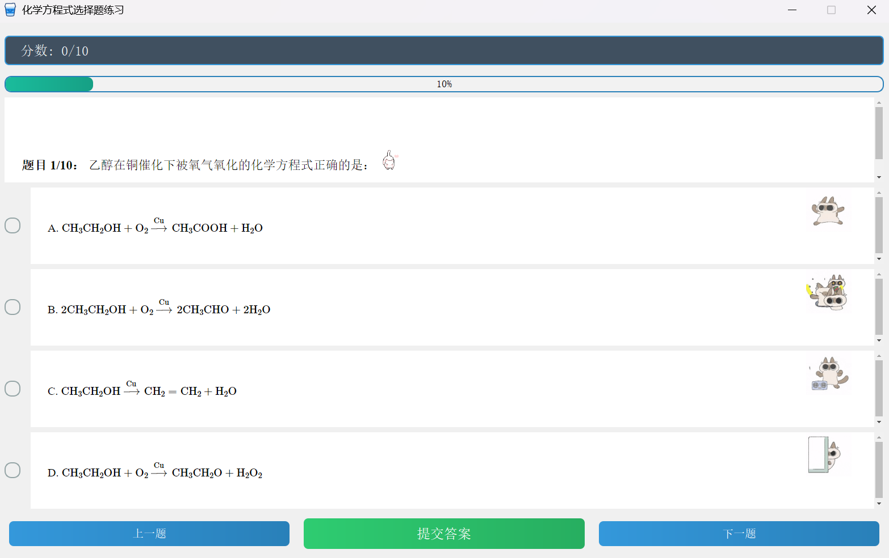
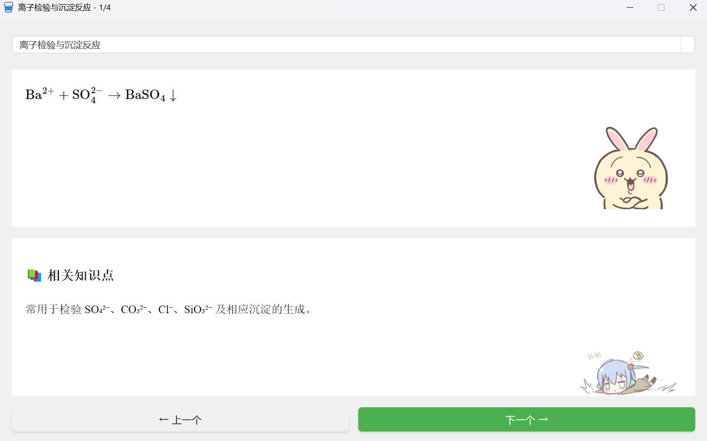

# 🧪 Cheqory – 化学方程式学习利器

> 这是为我的一个高三朋友设计的一个软件，让化学方程式练习像玩游戏一样轻松有趣！

[](https://www.python.org/downloads/)
[](https://pypi.org/project/PyQt5/)
[](LICENSE)
[](https://github.com/Aurorp1g/Cheqory)

---

## 📌 目录
- [功能特性](#功能特性)
- [界面预览](#界面预览)
- [安装与使用](#安装与使用)
- [技术栈](#技术栈)
- [项目结构](#项目结构)
- [贡献指南](#贡献指南)
- [许可证](#许可证)

---

## ✨ 功能特性
| 特性 | 说明 |
|------|------|
| 🎯 **智能练习** | 随机抽取方程式选择题，提交后即时评分与解析 |
| 📚 **分类学习** | 按「化合、分解、置换、复分解」等反应类型系统学习 |
| 🧮 **LaTeX渲染** | 无缝集成 MathJax，完美呈现化学式与数学公式 |
| 📊 **进度追踪** | 动态进度条 & 成就徽章，随时掌握学习效果 |
| 🪟 **多窗口** | 主控面板 + 多子窗口，支持并行练习与查阅 |

---

## 🎨 界面预览

| 主面板 | 练习模式 | 分类浏览 |
|---------|-----------|----------|
|  |  |  |

---

## 🚀 安装与使用

### 1️⃣ 运行源码（推荐开发者）
```bash
# 克隆仓库
git clone https://github.com/Aurorp1g/Cheqory.git
cd Cheqory

# 创建虚拟环境（可选）
python -m venv venv
source venv/bin/activate  # Windows 下使用 venv\Scripts\activate

# 安装依赖
pip install -r requirements.txt

# 启动应用
python main_control.py
```

### 2️⃣ 使用预编译版本（普通用户）
1. 前往 [Releases](https://github.com/Aurorp1g/Cheqory/releases) 下载 `Cheqory_Installer.exe`
2. 双击安装，桌面自动生成快捷方式
3. 开始愉快学习！

### 3️⃣ 自行打包（进阶用户）
```bash
# 一键打包（Windows）
pyinstaller Cheqory.spec
# 或手动命令
pyinstaller --onedir --contents-directory . -w ^
  --add-data "resources;resources" ^
  --add-data "mathjax;mathjax" ^
  --hidden-import=PyQt5.sip ^
  -i resources/logo.ico ^
  --name Cheqory main_control.py

# 生成安装包
makensis Cheqory_Installer.nsi
```

---

## 🛠️ 技术栈

| 分类 | 组件 | 版本 | 说明 |
|---|---|---|---|
| 语言 | Python | 3.9+ | 主要逻辑 |
| GUI | PyQt5 | 5.15+ | 跨平台图形界面 |
| 渲染 | MathJax | 3.2+ | 化学/数学公式高质量渲染 |
| 数据存储 | JSON | 内置 | 题库与化学知识点存储 |
| 打包 | PyInstaller | 5.6+ | 生成 Windows 可执行文件 |
| 安装 | NSIS | 3.08+ | 制作一键安装程序 |

---

## 📁 项目结构
```
Cheqory/
├── resources/                # 静态资源
│   ├── img/                  # 图标、按钮、背景
│   ├── sql/                  # SQLite 题库与配置
│   └── logo.ico              # 应用图标
├── mathjax/                  # MathJax 离线渲染引擎
├── common/                   # 公共模块（数据库/配置/工具函数）
├── ui/                       # Qt Designer 生成的 .ui 文件
├── main_control.py           # 入口 & 主窗口控制
├── quiz_app.py               # 练习模式业务逻辑
├── browse_app.py             # 分类浏览业务逻辑
├── logo.ico                  # 打包时使用的图标
├── Cheqory.spec              # PyInstaller 打包配置
├── Cheqory_Installer.nsi     # NSIS 安装程序配置
├── requirements.txt          # Python 依赖
├── README.md                 # 项目说明
└── LICENSE                   # Apache-2.0 许可证
```

额外开发测试：

```
├── quiz_app_test.py               # 测试练习模式业务逻辑
├── browse_app_test.py             # 测试分类浏览业务逻辑
```

---

## 🤝 贡献指南
欢迎 Issue / PR / Discussions！  
1. Fork 本仓库  
2. 新建 `feat/xxx` 或 `fix/xxx` 分支  
3. 提交代码并通过 `flake8` 检查  
4. 发起 Pull Request，描述清楚变更内容。

---

## 📄 许可证
[Apache License 2.0](LICENSE) © 2025 [Aurorp1g](https://github.com/Aurorp1g)

---

## 🔗 相关链接
- [📖 开发文档 Wiki](https://github.com/Aurorp1g/Cheqory/wiki)  
- [🐛 问题反馈](https://github.com/Aurorp1g/Cheqory/issues)  
- [⭐ 给我点个 Star](https://github.com/Aurorp1g/Cheqory)  

> 如果本项目对你有帮助，别忘了分享给同学/同事哦！
